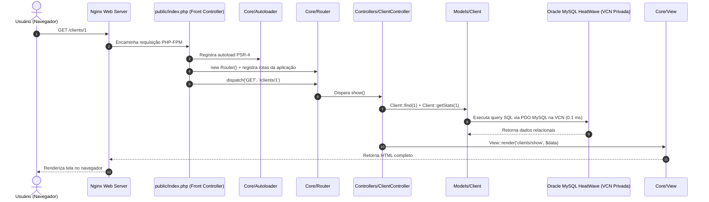

# 🏛️ Arquitetura do Sistema Alfasic

O **Alfasic** é um sistema integrado de gestão comercial, operacional e logística desenvolvido sob medida para a **Alfagás** (ALFA Comercial de Gases Ltda).

---

## 🎯 Filosofia Técnica: PHP Puro Moderno (Zero-Dependency)

O projeto foi desenhado sob uma diretriz arquitetural estrita: **100% PHP 8.5+ puro, sem frameworks pesados (como Laravel ou Symfony) e sem gerenciador de pacotes Composer**.

### Por que essa escolha é ideal?
1. **Performance Absoluta & Baixo Consumo:**
   * Roda sobre Nginx + PHP-FPM em ambiente Linux.
   * Baixíssimo consumo de memória RAM (< 10 MB por requisição) e inicialização instantânea (< 5ms).
2. **Longevidade & Manutenibilidade:**
   * Livre de *"Framework Rot"* (onde atualizações de versões quebram código legado).
   * O código escrito hoje funcionará perfeitamente por mais de uma década.
3. **Didática & Domínio dos Fundamentos:**
   * Cada componente (roteamento, autoloader, buffer de visualização, injeção de dependência e camada PDO) é compreendido e implementado na mão.

---

## ☁️ Arquitetura de Produção em Camadas (*Multi-Tier / Enterprise Private VCN*)

O sistema está hospedado em uma arquitetura corporativa dividida em duas camadas isoladas dentro da **Rede Virtual Privada (VCN)** da Oracle Cloud em **São Paulo (Vinhedo)**:

```mermaid
graph TD
    User["Navegador do Operador / Usuário"] -->|HTTPS Porta 443 + Let's Encrypt SSL| WebVM["Camada Web: Oracle Cloud Compute VM<br/>Ubuntu Linux + Nginx + PHP 8.5-FPM<br/>(Proteção HTTP Basic Auth + Memória Swap)"]
    WebVM -->|Rede Privada VCN Porta 3306 (Latência: < 0.1 ms)| DBCloud["Camada de Dados: Oracle MySQL HeatWave DB System<br/>Cluster Dedicado Gerenciado (Always Free)<br/>Backups Automáticos + Isolamento Total sem IP Público"]
```

### 🛡️ Benefícios de Segurança & Performance:
1. **Isolamento de Camada de Dados:** O banco de dados MySQL não roda na mesma VM do servidor web e **não possui IP público**, eliminando qualquer vetor de ataque vindo da internet.
2. **Latência de 0.1 ms (Mesma Região São Paulo):** A comunicação entre a VM Web e o MySQL roda na rede de fibra interna da Oracle Cloud.
3. **Estabilidade de Memória:** A VM Web possui 1 GB de RAM física + 2 GB de Swap, consumindo apenas ~150 MB (mais de 85% livre).

---

## 📁 Estrutura de Diretórios

```text
alfasic/
├── public/                 # Única pasta exposta publicamente ao servidor web
│   ├── index.php           # Front Controller (único ponto de entrada HTTP)
│   ├── css/                # Estilos CSS puros modernos (variáveis, feedback de validação)
│   ├── js/                 # Vanilla JS puro (Drawer lateral, busca instantânea, InputMasks, FormValidator)
│   └── images/             # Identidade visual oficial da Alfagás
├── src/                    # Código-fonte da aplicação (isolado e protegido)
│   ├── Core/               # Componentes estruturais (Autoloader, Router, View, Database, Env, Csrf, Validator)
│   ├── Controllers/        # Controladores MVC (Client, Supplier, Employee, Product, User, Role, Audit, Validation)
│   ├── Middlewares/        # Pipeline de segurança HTTP (Auth, Guest, Permission)
│   └── Models/             # Mini-ORM e Modelos de Domínio (Client, Supplier, Employee, Product, User, Role, AuditLog)
├── views/                  # Templates de visualização (HTML semântico + Componentes modulares)
│   ├── auth/               # Telas de autenticação (Login)
│   ├── components/         # Header, Command Palette, Workspace tabs, Page Header, Stats Bar, Pagination
│   ├── layouts/            # Layout mestre da aplicação (app.php)
│   ├── pages/              # Módulos de negócios organizados conforme menus do topo:
│   │   ├── management/     # Gestão: clients/, suppliers/, employees/, products/
│   │   └── system/         # Sistema: users/, roles/, audit/
│   └── home.php            # Dashboard principal
├── database/               # Esquema SQL oficial (schema.sql), scripts de migração e seeds
├── alfagas/                # Bancos históricos brutos e isolados (Access, HostGator, TagPlus, Unificado)
└── docs/                   # Documentação oficial, regras de negócio, arquitetura e handoff
```

---

## 🔄 Fluxo de uma Requisição HTTP (Request Lifecycle)


