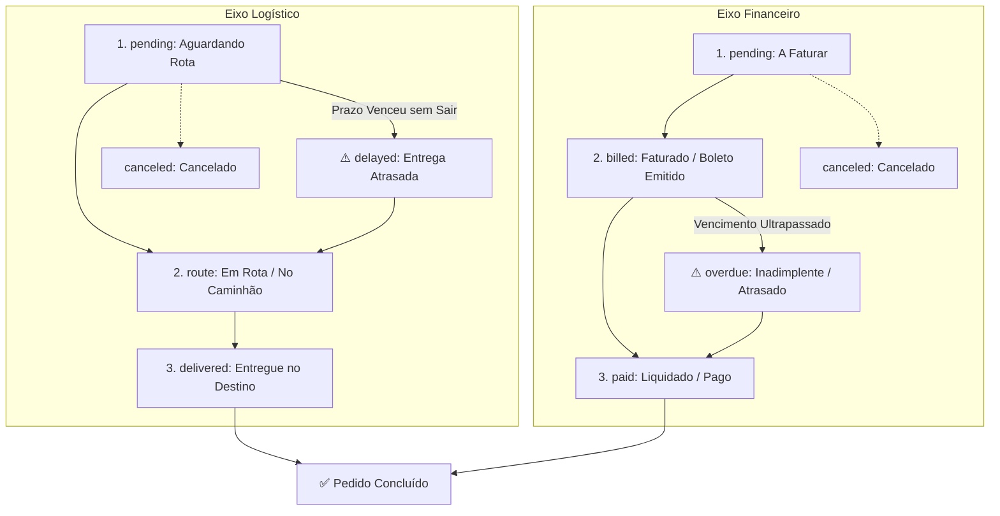

# 🧪 Modelo de Negócio Oficial: Alfagás (ERP Alfasic)

Este documento estabelece as **regras de negócio, diretrizes fiscais, fluxos operacionais e modelos de dados** que regem o ecossistema do **Alfasic** (ALFA Comercial de Gases Ltda).

---

## 🏢 1. Perfil da Empresa

* **Razão Social:** ALFA Comercial de Gases Ltda
* **Nome Fantasia:** ALFAGÁS
* **CNPJ:** `21.097.535/0001-00` &bull; **Inscrição Estadual:** `24.380.578/0001-80`
* **Matriz Operacional:** São Miguel dos Campos - AL (Loteamento Esther Soares Torres)
* **Filial / Ponto de Apoio:** ARAGAS (Arapiraca Gases Ltda) - Arapiraca - AL
* **Atividade Principal:** Revenda e distribuição de gases industriais, medicinais e especiais; comodato e locação de cilindros de alta pressão; fornecimento para órgãos públicos via licitações.

---

## 🔁 2. A Dualidade Fundamental: Gás (Consumível) vs Cilindro (Ativo Patrimonial)

Toda transação comercial na Alfagás envolve a separação estrita entre:
1. **O Gás (Mercadoria Vendida):** Vendido por volume ($m^3$, Litros) ou peso ($kg$).
   * *Medicinais:* Oxigênio Medicinal (hospitais, UBS, home care), Ar Comprimido Medicinal, Óxido Nitroso.
   * *Industriais:* Argônio Puro e Misturas (solda TIG/MIG), Acetileno, Dióxido de Carbono ($CO_2$), Nitrogênio, Hidrogênio.
2. **O Cilindro (Vasilhame de Alta Pressão):** Ativo de alto valor (R$ 1.500 a R$ 3.500 cada) que **não é vendido**, mas sim emprestado em comodato ou alugado em locação.

---

## 👥 3. Tipagem e Segmentação de Clientes

### A. Setor Governamental / Órgãos Públicos
* **Segmentos:** `Municipal` (Prefeituras, Fundos Municipais de Saúde, UBS), `Estadual` (Hospitais Regionais, SAMU, Secretarias de Estado) e `Federal` (Universidades Federais, HU, Forças Armadas).
* **Regra de Compra:**
  * **Ata de Registro de Preços (ARP Master):** Contratos licitatórios anuais com cotas homologadas e preços unitários travados.
  * **Dispensa de Licitação / Compra Direta / Emergência:** Compras diretas de baixo valor (Lei 14.133) ou emergências médicas, dispensando vínculo com ARP mas exigindo número de Empenho/Processo Administrativo.

### B. Setor Privado
* **Pessoa Jurídica (PJ):** Usinas sucroalcooleiras, indústrias, construtoras, metalúrgicas, hospitais privados e clínicas. Exigem CNPJ e Inscrição Estadual (I.E.).
* **Pessoa Física (PF):** Autônomos, soldadores e pacientes em oxigenoterapia domiciliar (CPF/RG).

---

## 🗺️ 4. Múltiplos Endereços & Determinação Automática de CFOP

Um cliente possui **1 endereço fiscal/sede (CNPJ/CPF)**, mas pode ter **múltiplos endereços de entrega** (postos de saúde, canteiros de obras, filiais).

* **Derivação Automática do CFOP:**
  * Se o endereço de entrega físico selecionado for em **Alagoas (`AL`)** $\rightarrow$ Aplica **CFOP Interno (`5.xxx`)**.
  * Se o endereço de entrega físico for em **outro estado (`SE`, `PE`, etc.)** $\rightarrow$ Aplica **CFOP Interestadual (`6.xxx`)**.

---

## 🚚 5. Engenharia de Frete

O frete é calculado dinamicamente com base em:
1. **Volume Total do Pedido ($m^3$):** Pedidos de grande porte diluem o custo de combustível (frete unitário reduzido ou zerado). Pedidos pequenos pagam taxa proporcional.
2. **Distância e Região de Entrega:** Zonas metropolitanas vs. Zona da Mata vs. Sertão alagoano.
3. **Urgências Fora da Rota:** Entregas prioritárias não programadas recebem taxa de deslocamento dedicado.

---

## 🔄 6. Ciclo de Vida do Pedido & Desacoplamento de Status

O pedido possui **dois eixos de status independentes**:

* **Prazos de Faturamento:** À Vista, Prazo em Dias (7, 14, 28, 30 dias), Dia Fixo do Mês ou Fechamento Mensal Agrupado.
* **Emissão e Ajuste de Notas no Pedido (Eventos na Linha do Tempo / Subpedidos):**
  * **Venda Normal com Permuta 1-pra-1:** O caminhão entrega 10 cheios e recolhe 10 vazios. **Emite apenas a NF-e de Venda do Gás (`5.102`/`6.102`)**, sem necessidade de nota de vasilhame.
  * **Diferença Avisada Previamente:** Se o cliente avisa antes que reterá 2 cilindros (ou devolverá 2 a mais), o sistema já emite a NF-e de Venda (`5.102`) + a NF-e de Comodato (`5.908`) ou de Entrada (`1.909`).
  * **Conferência na Entrega (Ajuste do Motorista / Subpedidos):** Se houver divergência física no local:
    * Se faltou vasilhame na volta $\rightarrow$ o sistema registra um evento de entrega e emite a **NF-e de Remessa em Comodato (`5.908`/`6.908`)** do casco retido.
    * Se o comodato foi gerado preventivamente mas o cliente achou os cascos $\rightarrow$ o sistema cancela/estorna a nota de comodato.
    * Se o cliente devolveu cilindros extras $\rightarrow$ o sistema gera a **NF-e de Entrada (`1.909`/`2.909`)**.

---

## 📜 7. Catálogo Completo de CFOPs Oficiais & Emissão de Documentos

### A. Operações com Clientes
| Operação | CFOP Estadual (`AL`) | CFOP Interestadual | Emissor da Nota | Descrição e Finalidade |
| :--- | :---: | :---: | :---: | :--- |
| **Venda da Carga de Gás (Permuta 1-pra-1)** | **`5.102`** | **`6.102`** | **Alfagás** | Venda da recarga. Troca de vasilhame direta (sem nota extra). |
| **Remessa em Comodato Gratuito** | **`5.908`** | **`6.908`** | **Alfagás** | Empréstimo do vasilhame sem cobrança (retenção no cliente). |
| **Remessa em Locação Paga (Aluguel)** | **`5.949`** | **`6.949`** | **Alfagás** | Remessa de bem para locação comercial remunerada (*Sem ICMS*). |
| **Devolução por Cliente PJ (com I.E.)** | **`5.909`** | **`6.909`** | **Cliente PJ** | O cliente emite a nota de saída dele. **Alfagás dá entrada no XML (sem emitir nova nota)**. |
| **Devolução por Cliente PF / Órgão Público** | **`1.909`** | **`2.909`** | **Alfagás** | **Nota de Entrada emitida pela Alfagás** quando o cliente não possui emissor próprio. |

### B. Operações com Usinas Fornecedoras (Linde, Messer, White Martins)
| Operação | CFOP Estadual (`AL`) | CFOP Interestadual | Emissor da Nota | Descrição e Finalidade |
| :--- | :---: | :---: | :---: | :--- |
| **Remessa de Cilindros Vazios para Encher** | **`5.920`** | **`6.920`** | **Alfagás** | **Obrigatória na rodovia:** Nosso caminhão levando cascos vazios para a Usina. |
| **Compra do Gás na Usina (Entrada)** | **`1.102`** | **`2.102`** | **Usina** | Nota emitida pela Usina vendendo a carga/molécula de gás para a Alfagás. |
| **Retorno dos Cilindros Envasados (Entrada)** | **`1.921`** | **`2.921`** | **Usina** | Nota emitida pela Usina devolvendo nossos vasilhames cheios. |

### C. Transferências entre Matriz (São Miguel) e Filial (ARAGAS - Arapiraca)
| Operação | CFOP Saída (Matriz) | CFOP Entrada (Filial) | Descrição e Finalidade |
| :--- | :---: | :---: | :--- |
| **Transferência de Gás Cheio** | **`5.152`** | **`1.152`** | Transferência de mercadoria para revenda na filial. |
| **Transferência de Vasilhames Vazios/Cheios** | **`5.920`** | **`1.920`** | Transferência física de embalagens e vasilhames entre os pátios. |

---

## 🏷️ 8. Vasilhames, Aluguel e Tipos de Ordens

### A. Os 4 Tipos de Ordens do Sistema
1. **Pedido de Venda (Gases e Acessórios):** Fatura a mercadoria e gerencia a permuta 1-pra-1 ou comodato/devolução de cascos atrelada.
2. **Ordem de Coleta / Devolução Avulsa:** Usada exclusivamente quando **não há venda associada** (cliente encerrou obra e quer devolver cascos para parar a locação). Gera NF-e `1.909` e baixa por FIFO.
3. **Ordem de Reabastecimento na Usina:** Caminhão pesado na estrada: Remessa de Vazios (`5.920`) $\rightarrow$ Compra do Gás (`1.102`) $\rightarrow$ Retorno dos Cheios (`1.921`).
4. **Transferência entre Filiais:** Movimentação de estoque entre São Miguel dos Campos e Arapiraca.

### B. Gestão de Custódia e Coleta
* **Cálculo de Custódia:**
  $$\text{Saldo Atual em Posse} = \sum (\text{Cilindros em Comodato/Locação Entregues}) - \sum (\text{Cilindros Devolvidos})$$
* **Ordem de Coleta:** Quando o cliente solicita a retirada de cilindros vazios:
  1. A cobrança de diárias de aluguel/locação é **congelada na data da solicitação**;
  2. O saldo físico em posse do cliente é **baixado quando o motorista executa a coleta na rota**.
* **Baixa por FIFO (*First-In, First-Out*):** Devoluções abatem os empréstimos de comodato dos mais antigos para os mais novos, referenciando as respectivas chaves de acesso (`ref_nfe_key`).

---

## 📈 9. Política de Reajuste em Massa de Preços

* **Reajuste em Lote:** O sistema permite selecionar múltiplos clientes (ou a tabela base geral) e aplicar porcentagens de aumento (ex: `+8%`) ou valor fixo em reais na tabela `client_prices`, registrando a data do reajuste.
* **Licitações Públicas (ARPs):** Preços de editais governamentais são **blindados contra reajustes automáticos**, permanecendo travados durante a vigência anual do contrato.
